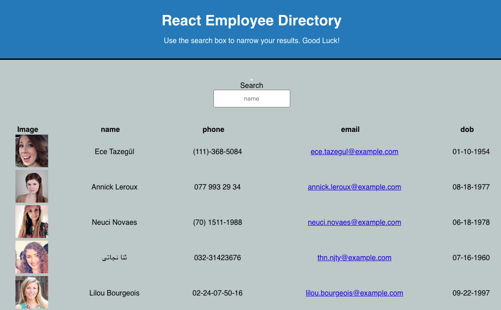
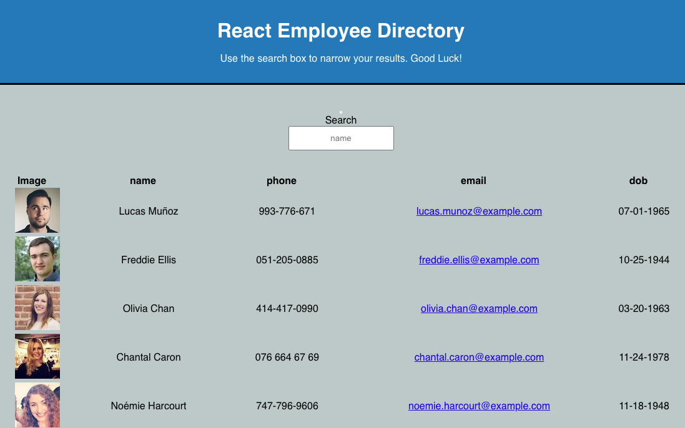
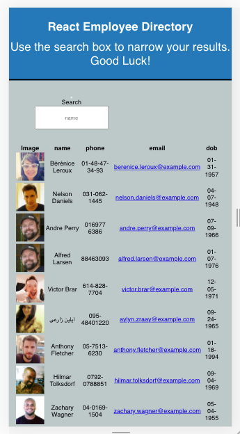

# react19-employee-directory Application Homework !

   ## License
   

   # Table of Contents

   * [Description](#Description)

   * [Runing a command-line application ](#Runing-a-command-line-application) 

   * [Installation Instructions](#installation-instructions)
  
   * [Usage Instructions](#usage-instructions)
  
   * [Contribution](#Contribution)
  
   * [Developers Contact Information](#Developers-Contact-Information)

   * [License](#license)

   # Description

   * This application is a react employee directory  developed to.
   * This application uses UI break in to components, manage component state, and respond to user events and access to their information. 
   * yuo can be able to view the entire employee directory at once .
   * This Application has great benefit from being able to view non-sensitive data about other employees.
.
   * I included in package.js as dependence
   * I created models and routes to connect with back end codes.

   * npm install to a given dependence
   * package.js
   * react app package,
   * build,
   * gh-pages,
   * axios

   * Acceptance Criteria.

   * users can quickly and easily loads the page, you will be get the option to search particularly helpful to be able to filter employees by name.
.

   * you can random users generated from [Random User API](https://randomuser.me/), when the user loads the page, a table of employees render. 
   
   * View the randomuser employees  on the list page.

   #  Runing a command-line application 

   
   * You can  see the randomuser employee's on list.
 
   * You can View the stored database in a database interms of table.

   * The app runs as a `npm start` to gather information about react epmloyee dirctory. 

   * My react19-employee-directory web applications react app that is readable, reliable, and maintainable Oftentimes, node_modules,  main Readme, Screenshots.

   * I put my LinkedIn profile, my github URL repository, heroku url and email address working activly.

   ## Installation Instructions

   * The developer is authorizing a free installation by cloning from the repository code:- 

   * [destish21/react19-employee-directory](https://github.com/destish21/react19-employee-directory)

   * you can run by install npm i to include node_module, express, morgan, mongoose, dev, dotenv, copmression and mongoDB_URL and localhost.

   * you can run by node `nodemon server.js or by node server.js` react19-employee-directory.

   # screenshot Image 1
   * 

   ## Usage Instructions

   * For this app to run make sure first:-

   * creat repository in your github, then clone the code from my github repository,

   * [destish21/react19-employee-directory](https://github.com/destish21/react19-employee-directory)

   * Install all necessary  node_moduales like all react packages, break up to components, and build etc.

   * Make sure every files imported and add axios gh-pages run by `npm i or npm install`
     in your computer.

   * Once in the directory run npm install to install the axios gh-pages needed to run the app.
    Run by  `npm start` in your computer command line.

   * You can add new or subtract the expenses.

   * A`react19-employee-directory
     App !!` will be desplayed after you run the see npm start !. 

   * you can manage your apps using API calling easly.

   * It built with diferent package to connect to my deploy database and perform requeries `databases` file and return all files.

   * models, routes to interact with the user the command-line.

   * you can  quickly access to emails and GitHub profiles.

   * My `react19-employee-directory`
    is in my github repository enjoy it!
   * Screenshot Images 2
 
   * 
   * 
   
   ## Contribution

   * This is Contributed by [destish21/react19-employee-directory](https://github.com/destish21/react19-employee-directory). 
   
   * But Contribution, issues and feature requests are welcome.
   * Feel free to check issues page if you want to contribute. 
   * you can contact me by Contact Information here below.

   ## Developers Contact Information
   * LinkdIn Profile : [Desta Mulualem](https://www.linkedin.com/in/desta-mulualem-6718b1203/)
   * Deployed URL : [react19-employee-directory](https://destish21.github.io/react19-employee-directory/)
   * github URL :  https://github.com/destish21/react19-employee-directory
   * Email: destish21@yahoo.com
   
   # Desta Mulualem. All Rights Reserved © 03/30/2021.
